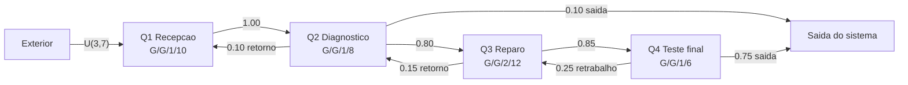
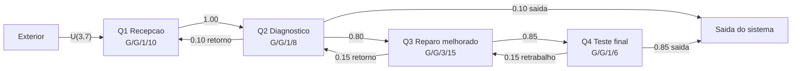

# Simulacao de rede de filas - T2

Este projeto implementa uma simulacao de rede de filas para uma assistencia tecnica de computadores e celulares. O objetivo e comparar o modelo atual com um modelo melhorado, calculando probabilidades dos estados, perdas de clientes e indices de desempenho das filas.

## Problema modelado

A assistencia recebe clientes na recepcao, realiza triagem, diagnostico tecnico, manutencao/reparo e teste final. Alguns atendimentos retornam para etapas anteriores quando ha necessidade de retrabalho, novo diagnostico ou reparo adicional. Por isso, a rede nao e uma fila simples em tandem.

## Filas do modelo inicial

| Fila | Etapa | Kendall | Servidores | Capacidade | Chegada externa | Atendimento |
| --- | --- | --- | ---: | ---: | --- | --- |
| Q1 | Recepcao e triagem | G/G/1/10 | 1 | 10 | U(3, 7), primeira chegada em 2.0 | U(2, 5) |
| Q2 | Diagnostico tecnico | G/G/1/8 | 1 | 8 | Nao possui | U(8, 15) |
| Q3 | Manutencao/reparo | G/G/2/12 | 2 | 12 | Nao possui | U(20, 40) |
| Q4 | Teste final e retirada | G/G/1/6 | 1 | 6 | Nao possui | U(5, 12) |

## Rede de roteamento inicial



## Modelo melhorado

A melhoria foi concentrada em Q3, que apresentava maior tempo de resposta e perdas no modelo inicial:

| Parametro | Inicial | Melhorado |
| --- | ---: | ---: |
| Servidores em Q3 | 2 | 3 |
| Capacidade de Q3 | 12 | 15 |
| Atendimento em Q3 | U(20, 40) | U(18, 32) |
| Probabilidade Q4 -> Q3 | 0.25 | 0.15 |
| Probabilidade Q4 -> saida | 0.75 | 0.85 |



## Como executar

Compile e execute:

```bash
javac SimuladorFila.java
java SimuladorFila
```

Tambem e possivel informar os arquivos dos modelos:

```bash
java SimuladorFila modelo_inicial.yml modelo_melhorado.yml
```

## Arquivos

- `SimuladorFila.java`: simulador de eventos discretos e calculo dos indices.
- `modelo_inicial.yml`: configuracao do modelo atual.
- `modelo_melhorado.yml`: configuracao do modelo futuro com melhoria.
- `resultados_simulacao.txt`: saida completa da simulacao, incluindo probabilidades por estado.
- `apresentacao_t2.md`: conteudo dos slides para apresentacao.
- `roteiro_video.md`: roteiro curto para gravar o video comentado.

## Indices calculados

- Populacao media: soma dos estados ponderados pelas probabilidades de permanencia em cada estado.
- Vazao: quantidade de atendimentos concluida pela fila dividida pelo tempo global da simulacao.
- Utilizacao: tempo ocupado acumulado dos servidores dividido pelo tempo total disponivel dos servidores.
- Tempo de resposta: populacao media dividida pela vazao, seguindo a Lei de Little.
- Perdas: clientes recusados quando a fila esta na capacidade maxima.

## Conclusao esperada

O modelo melhorado reduz fortemente o gargalo de Q3: o tempo de resposta cai de aproximadamente 164,37 para 25,89 minutos e as perdas em Q3 sao eliminadas na execucao com a semente 42. As perdas totais tambem caem, mas Q2 continua com utilizacao proxima de 100%, indicando que uma evolucao futura deveria atacar o diagnostico tecnico.
